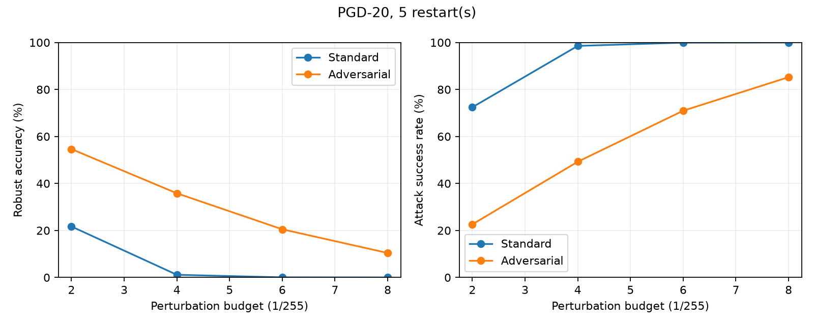

# Adversarial Training via Min-Max Optimization

A PyTorch study of clean continuation and mixed adversarial fine-tuning on
CIFAR-10. PGD approximates the inner maximization over image perturbations;
SGD updates the classifier. Developed by Anna Makridou and Alexandros Fourtounis
for CS-573: Optimization Methods, University of Crete.

**Status:** the full seed 42 experiment is complete on an RTX 4060 with CUDA.
All 18 regression tests pass on Windows. This is a completed course project
with a single-seed empirical evaluation.

[Report (PDF)](report.pdf) | [Report source](main.tex) |
[Results and protocol](docs/results/full_cuda/README.md) |
[Reproduction guide](docs/run-guide.md) | [Validation record](docs/validation.md)

## Measured results

Both branches start from the same final clean pre-training checkpoint and receive
five further epochs, with the same number of optimizer updates. Validation selects
the checkpoints. Final evaluation uses all 10,000 test images, PGD-20, five random
restarts, and step size 2/255.

| Test accuracy | Clean control | Mixed adversarial |
| --- | ---: | ---: |
| Clean images | 78.70% | 70.59% |
| Robust, epsilon 2/255 | 21.69% | 54.63% |
| Robust, epsilon 4/255 | 1.14% | 35.82% |
| Robust, epsilon 6/255 | 0.05% | 20.50% |
| Robust, epsilon 8/255 | 0.00% | 10.42% |

At 4/255, robust accuracy increases by **34.68 percentage points**, with an
**8.11-point reduction in clean accuracy**. These measurements describe seed 42
under this protocol; they do not establish statistical significance or certify robustness.



## Method

For adversarial loss weight `r`, training minimizes

```text
E[(1-r) CE(f(x), y) + r max_{z in [0,1], ||z-x||_inf <= epsilon} CE(f(z), y)]
```

The measured adversarial branch uses `r=0.5`: both losses are computed on every
batch. Pure adversarial training (`r=1`) and FGSM are implemented and tested, but
are not experiments in the full results table.

Images remain in `[0,1]`; channel normalization is inside the model. Attacks freeze
dropout and batch statistics, compute input gradients, and restore module modes.
Training PGD selects by cross-entropy; evaluation retains successful attacks
across steps and restarts, breaking ties by loss. The clean input is included.

The CNN has four convolutions (`3 -> 64 -> 128 -> 256 -> 256`), two pooling stages,
and a `16384 -> 512 -> 10` classifier: **9,356,554 trainable parameters**.

The protocol uses 45,000 training images and 5,000 validation images, ten clean
pre-training epochs, and five epochs for each branch. Branches have equal update
budgets, not equal computation. See [the report](docs/report.md) for attack settings,
learning-rate schedules, checkpoint selection, and limitations.

## Reproduce

On Windows, follow the [tested CUDA setup](docs/windows-guide.md). The measured
environment used Python 3.13.14 and PyTorch 2.11.0+cu128. Its exact installed
packages are in [requirements-lock-windows.txt](requirements-lock-windows.txt).

For a general Python 3.10+ environment, install a compatible PyTorch/torchvision
pair for your platform and then:

```bash
python -m pip install -r requirements.txt
python -m unittest discover -s tests -v
python -m scripts.run_experiment --profile full --device cuda --num-workers 0 --seeds 42 --output-dir output/experiments/reproduction
```

The last command previews the plan. Add `--execute` to run it. CIFAR-10 downloads
to `data/` if the archive is absent. Use `--device mps` or `--device cpu` where
appropriate. Exact results across devices and versions are not guaranteed.

Training saves configurations, histories, and best/final/latest checkpoints.
Rerunning an interrupted experiment with identical settings resumes completed
epochs; analysis restarts. Use a fresh directory for a different protocol.

## Inspect and regenerate results

The compact results are included as portable JSON, with metrics, exact counts,
checkpoint hashes, and training histories. The full local run lives in
`output/experiments/full_cuda/` and is intentionally excluded from Git.

```bash
python -m scripts.create_comparison_plots --standard docs/results/full_cuda/clean_control.json --robust docs/results/full_cuda/adversarial.json --output output/plots/comparison.png
python -m scripts.create_summary_report --standard docs/results/full_cuda/clean_control.json --robust docs/results/full_cuda/adversarial.json --output output/summary.md
python -m scripts.plot_training --log-file docs/results/full_cuda/adversarial_history.json --output output/plots/adversarial_training.png
python -m scripts.verify_release
```

`scripts.export_results` verifies the original local run against its saved source,
protocol, and checkpoint hashes before exporting portable records. New tooling
added after training is documented separately from the training-time source manifest.

## Build the report

The source uses standard LaTeX packages and the measured comparison figure.
From the repository root, run `tectonic main.tex` (Tectonic 0.17.0 was used), then
rename the generated `main.pdf` to `report.pdf`. Alternatively, run
`pdflatex main.tex` twice, or upload the source and `docs/results/full_cuda/comparison.png`
to Overleaf. The existing PDF is ready to read without a LaTeX installation.

## Project files

| Path | Purpose |
| --- | --- |
| `attacks.py`, `model_arch.py` | PGD/FGSM and classifier |
| `training.py`, `utils.py` | Training, splits, metrics, checkpoints, recovery |
| `main_standard.py`, `main_robust.py` | Individual training entry points |
| `experiments/` | Full and subset-pilot protocols |
| `scripts/` | Experiment runner, analysis, export, and release checks |
| `tests/` | Attack, metric, training, and recovery regression tests |
| `docs/results/full_cuda/` | Verified full-data measurements and provenance |
| `docs/results/pilot/` | Earlier subset pilot, kept separate |
| `main.tex`, `report.pdf` | Current course report source and PDF |

## Scope and provenance

An earlier version attacked normalized tensors while clipping to `[0,1]`. Its
historical accuracy figures and eleven-experiment narrative are not evidence for
the corrected threat model. The current report supersedes those claims; the
earlier source/PDF are preserved locally under `output/archive/`.

The study uses one seed and one attack family. Additional seeds and independent
attack suites would test how well the observations generalize. Neither optimal
hyperparameters nor deployment safety is claimed. The project is coursework,
not a published paper. No software license has been granted in this repository;
the authors should agree on any future license.

## References

- Madry et al. (2018), [Towards Deep Learning Models Resistant to Adversarial Attacks](https://arxiv.org/abs/1706.06083).
- Goodfellow et al. (2015), [Explaining and Harnessing Adversarial Examples](https://arxiv.org/abs/1412.6572).
- Krizhevsky (2009), [CIFAR-10 dataset and technical report](https://www.cs.toronto.edu/~kriz/cifar.html).
